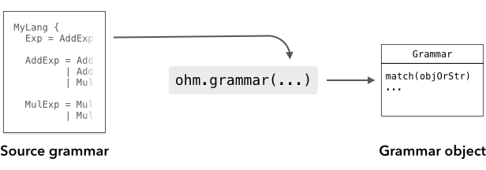
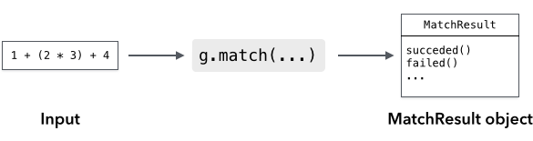
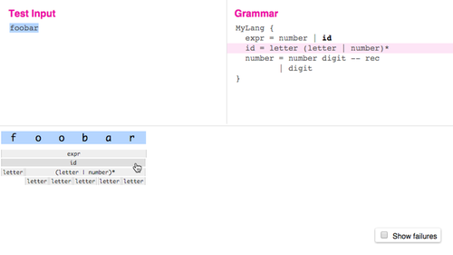
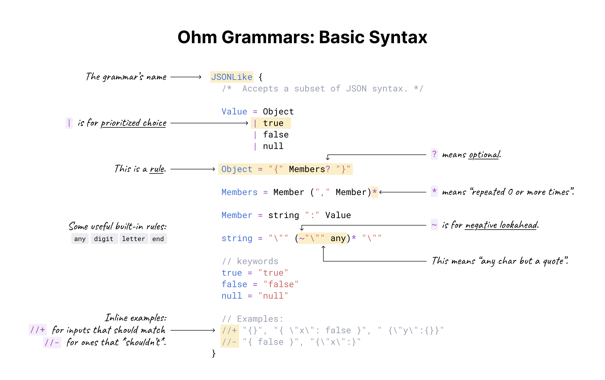

# Introduction

## Getting Started

The easiest way to get started with Ohm is to use the [interactive editor](https://ohmjs.org/editor/). Alternatively, you can play with one of the following examples on JSFiddle:

- [Basic parsing example](https://jsfiddle.net/pdubroy/p3b1v2xb/)
- [Arithmetic example with semantics](https://jsfiddle.net/pdubroy/15k63qae/)

## Resources

- Tutorial: [Ohm: Parsing Made Easy](https://nextjournal.com/dubroy/ohm-parsing-made-easy)
- The [math example](https://github.com/ohmjs/ohm/tree/main/examples/math/index.html) is extensively commented and is a good way to dive deeper.
- [Examples](https://github.com/ohmjs/ohm/tree/main/examples/)
- For community support and discussion, join us on [Discord](https://discord.gg/KwxY5gegRQ), [GitHub Discussions](https://github.com/ohmjs/ohm/discussions), or the [ohm-discuss mailing list](https://groups.google.com/u/0/g/ohm-discuss).
- For updates, follow [@\_ohmjs on Twitter](https://twitter.com/_ohmjs).

## Installation

### On a web page

To use Ohm in the browser, just add a single `<script>` tag to your page:

```html
<!-- Development version of Ohm from unpkg.com -->
<script src="https://unpkg.com/ohm-js@17/dist/ohm.js"></script>
```

or

```html
<!-- Minified version, for faster page loads -->
<script src="https://unpkg.com/ohm-js@17/dist/ohm.min.js"></script>
```

This creates a global variable named `ohm`.

### Node.js

First, install the `ohm-js` package with your package manager:

- [npm](http://npmjs.org): `npm install ohm-js`
- [Yarn](https://yarnpkg.com/): `yarn add ohm-js`
- [pnpm](https://pnpm.io/): `pnpm add ohm-js`

Then, you can use `require` to use Ohm in a script:

<!-- @markscript
  markscript.transformNextBlock(s => s.replace('const ', 'var '));
-->

```js
const ohm = require('ohm-js');
```

Ohm can also be imported as an ES module:

```js
import * as ohm from 'ohm-js';
```

### Deno

To use Ohm from [Deno](https://deno.land/):

```js
import * as ohm from 'https://unpkg.com/ohm-js@17';
```

## Basics

### Defining Grammars



To use Ohm, you need a grammar that is written in the Ohm language. The grammar provides a formal
definition of the language or data format that you want to parse. There are a few different ways
you can define an Ohm grammar:

- The simplest option is to define the grammar directly in a JavaScript string and instantiate it
  using `ohm.grammar()`. In most cases, you should use a [template literal with String.raw](https://developer.mozilla.org/en-US/docs/Web/JavaScript/Reference/Global_Objects/String/raw):

  ```js
  const myGrammar = ohm.grammar(String.raw`
    MyGrammar {
      greeting = "Hello" | "Hola"
    }
  `);
  ```

- **In Node.js**, you can define the grammar in a separate file, and read the file's contents and instantiate it using `ohm.grammar(contents)`:

  In `myGrammar.ohm`:

  ```
  MyGrammar {
    greeting = "Hello" | "Hola"
  }
  ```

  In JavaScript:

  ```js
  const fs = require('fs');
  const ohm = require('ohm-js');
  const contents = fs.readFileSync('myGrammar.ohm', 'utf-8');
  const myGrammar = ohm.grammar(contents);
  ```

For more information, see [Instantiating Grammars](api-reference.md#instantiating-grammars) in the API reference.

### Using Grammars



<!-- @markscript
  // The duplication here is required because Markscript only executes top-level code blocks.
  // TODO: Consider fixing this in Markscript.
  const myGrammar = ohm.grammar('MyGrammar { greeting = "Hello" | "Hola" }');
-->

Once you've instantiated a grammar object, use the grammar's `match()` method to recognize input:

```js
const userInput = 'Hello';
const m = myGrammar.match(userInput);
if (m.succeeded()) {
  console.log('Greetings, human.');
} else {
  console.log("That's not a greeting!");
}
```

The result is a MatchResult object. You can use the `succeeded()` and `failed()` methods to see whether the input was recognized or not.

For more information, see the [API Reference](api-reference.md).

## Debugging

Ohm has two tools to help you debug grammars: a text trace, and a graphical visualizer.

[](https://ohmjs.org/editor)

You can [try the visualizer online](https://ohmjs.org/editor).

To see the text trace for a grammar `g`, just use the [`g.trace()`](api-reference.md#Grammar.trace)
method instead of `g.match`. It takes the same arguments, but instead of returning a MatchResult
object, it returns a Trace object — calling its `toString` method returns a string describing
all of the decisions the parser made when trying to match the input. For example, here is the
result of `g.trace('ab').toString()` for the grammar `G { start = letter+ }`:

<!-- @markscript
  markscript.transformNextBlock(function(code) {
    const trace = ohm.grammar('G { start = letter+ }').trace('ab');
    assert.equal(trace.toString().trim(), code.trim());
  });
-->

```
ab         ✓ start ⇒  "ab"
ab           ✓ letter+ ⇒  "ab"
ab             ✓ letter ⇒  "a"
ab                 ✓ lower ⇒  "a"
ab                   ✓ Unicode [Ll] character ⇒  "a"
b              ✓ letter ⇒  "b"
b                  ✓ lower ⇒  "b"
b                    ✓ Unicode [Ll] character ⇒  "b"
               ✗ letter
                   ✗ lower
                     ✗ Unicode [Ll] character
                   ✗ upper
                     ✗ Unicode [Lu] character
                   ✗ unicodeLtmo
                     ✗ Unicode [Ltmo] character
           ✓ end ⇒  ""
```

## Quick reference


